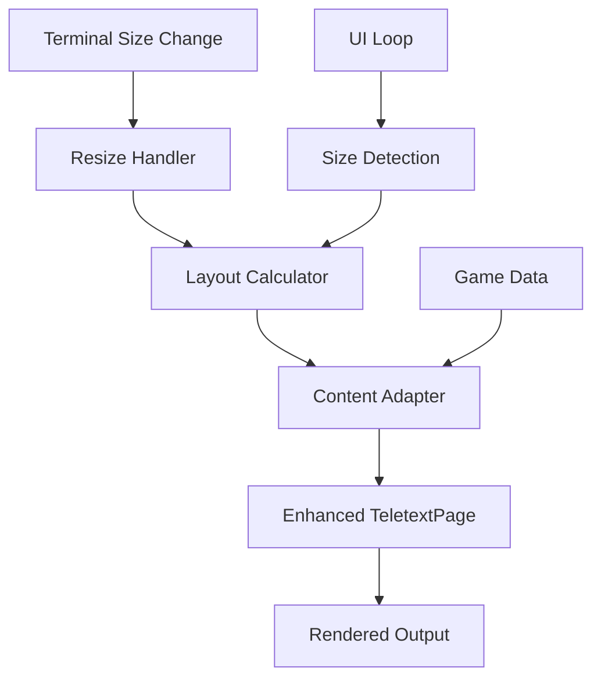

# Design Document

## Overview

This design implements dynamic space utilization for the teletext UI while maintaining the existing structure and aesthetic. The solution focuses on making the UI responsive to terminal dimensions through adaptive layout calculations, enhanced content rendering, and real-time resize handling.

The design preserves the current architecture where `TeletextPage` handles rendering and `interactive.rs` manages the UI loop, but enhances these components with dynamic sizing capabilities.

## Architecture

### Core Components

1. **Layout Calculator** - New module responsible for calculating optimal layouts based on terminal dimensions
2. **Enhanced TeletextPage** - Extended with dynamic rendering capabilities
3. **Resize Handler** - Component for detecting and responding to terminal size changes
4. **Content Adapter** - Logic for adjusting content detail level based on available space

### Component Interaction Flow



## Components and Interfaces

### Layout Calculator Module

**Location:** `src/ui/layout.rs`

```rust
pub struct LayoutCalculator {
    min_width: u16,
    min_height: u16,
    current_dimensions: (u16, u16),
}

pub struct LayoutConfig {
    pub content_width: u16,
    pub content_height: u16,
    pub games_per_page: usize,
    pub detail_level: DetailLevel,
    pub horizontal_padding: u16,
}

pub enum DetailLevel {
    Minimal,    // Current behavior for small screens
    Standard,   // Enhanced details for medium screens
    Extended,   // Full details for large screens
}

impl LayoutCalculator {
    pub fn new() -> Self;
    pub fn calculate_layout(&self, terminal_size: (u16, u16)) -> LayoutConfig;
    pub fn get_optimal_games_per_page(&self, available_height: u16) -> usize;
    pub fn determine_detail_level(&self, available_width: u16) -> DetailLevel;
}
```

### Enhanced TeletextPage

**Modifications to:** `src/teletext_ui.rs`

```rust
impl TeletextPage {
    // New fields
    layout_config: LayoutConfig,
    layout_calculator: LayoutCalculator,
    
    // Enhanced methods
    pub fn update_layout(&mut self, terminal_size: (u16, u16));
    pub fn render_with_layout(&self, stdout: &mut Stdout) -> Result<(), AppError>;
    
    // New rendering methods
    fn render_game_with_detail_level(&self, game: &TeletextRow, detail_level: DetailLevel) -> String;
    fn calculate_content_positioning(&self) -> ContentPositioning;
}

pub struct ContentPositioning {
    pub header_y: u16,
    pub content_start_y: u16,
    pub content_end_y: u16,
    pub footer_y: u16,
    pub left_margin: u16,
    pub right_margin: u16,
}
```

### Resize Handler

**Location:** `src/ui/resize.rs`

```rust
pub struct ResizeHandler {
    last_size: (u16, u16),
    resize_debounce: Duration,
    last_resize_time: Instant,
}

impl ResizeHandler {
    pub fn new() -> Self;
    pub fn check_for_resize(&mut self) -> Option<(u16, u16)>;
    pub fn should_update_layout(&self, current_size: (u16, u16)) -> bool;
}
```

### Content Adapter

**Location:** `src/ui/content_adapter.rs`

```rust
pub struct ContentAdapter;

impl ContentAdapter {
    pub fn adapt_game_content(
        game: &GameResultData, 
        detail_level: DetailLevel,
        available_width: u16
    ) -> AdaptedGameContent;
    
    pub fn format_team_names(
        home: &str, 
        away: &str, 
        available_width: u16
    ) -> (String, String);
    
    pub fn format_goal_events(
        events: &[GoalEventData],
        detail_level: DetailLevel,
        available_width: u16
    ) -> Vec<String>;
}

pub struct AdaptedGameContent {
    pub home_team: String,
    pub away_team: String,
    pub time_display: String,
    pub result_display: String,
    pub goal_lines: Vec<String>,
    pub estimated_height: u16,
}
```

## Data Models

### Configuration Constants

**Addition to:** `src/constants.rs`

```rust
pub mod dynamic_ui {
    /// Minimum terminal width for proper display
    pub const MIN_TERMINAL_WIDTH: u16 = 80;
    
    /// Minimum terminal height for proper display  
    pub const MIN_TERMINAL_HEIGHT: u16 = 24;
    
    /// Width threshold for standard detail level
    pub const STANDARD_DETAIL_WIDTH_THRESHOLD: u16 = 100;
    
    /// Width threshold for extended detail level
    pub const EXTENDED_DETAIL_WIDTH_THRESHOLD: u16 = 120;
    
    /// Maximum horizontal padding as percentage of width
    pub const MAX_HORIZONTAL_PADDING_PERCENT: f32 = 0.1;
    
    /// Debounce time for resize events (milliseconds)
    pub const RESIZE_DEBOUNCE_MS: u64 = 100;
    
    /// Base height per game in minimal mode
    pub const BASE_GAME_HEIGHT: u16 = 3;
    
    /// Additional height per game in extended mode
    pub const EXTENDED_GAME_HEIGHT_BONUS: u16 = 2;
}
```

### Enhanced Game Display Data

```rust
#[derive(Debug, Clone)]
pub struct EnhancedGameDisplay {
    pub base_content: GameResultData,
    pub extended_team_info: Option<ExtendedTeamInfo>,
    pub detailed_time_info: Option<DetailedTimeInfo>,
    pub expanded_goal_details: Vec<ExpandedGoalDetail>,
}

#[derive(Debug, Clone)]
pub struct ExtendedTeamInfo {
    pub full_home_name: String,
    pub full_away_name: String,
    pub home_record: Option<String>,
    pub away_record: Option<String>,
}

#[derive(Debug, Clone)]
pub struct DetailedTimeInfo {
    pub precise_timestamp: String,
    pub game_duration: Option<String>,
    pub period_info: Option<String>,
}

#[derive(Debug, Clone)]
pub struct ExpandedGoalDetail {
    pub scorer: String,
    pub assist1: Option<String>,
    pub assist2: Option<String>,
    pub time: String,
    pub situation: Option<String>,
}
```

## Error Handling

### Resize Error Handling

- **Terminal Size Detection Failure**: Fall back to last known dimensions or default minimum size
- **Layout Calculation Errors**: Use safe defaults and log warnings
- **Render Buffer Overflow**: Implement content truncation with ellipsis indicators

### Graceful Degradation

- **Insufficient Width**: Progressively reduce detail level and truncate content
- **Insufficient Height**: Maintain pagination with adjusted page sizes
- **Memory Constraints**: Limit buffer sizes and use streaming rendering for large content

## Testing Strategy

### Unit Tests

1. **Layout Calculator Tests**
   - Test layout calculation for various terminal sizes
   - Verify detail level determination logic
   - Test edge cases (minimum sizes, extreme dimensions)

2. **Content Adapter Tests**
   - Test content adaptation for different detail levels
   - Verify text truncation and formatting
   - Test goal event formatting with various input sizes

3. **Resize Handler Tests**
   - Test resize detection and debouncing
   - Verify size change validation
   - Test rapid resize scenarios

### Integration Tests

1. **End-to-End Rendering Tests**
   - Test complete rendering pipeline with various terminal sizes
   - Verify layout consistency across size changes
   - Test pagination behavior with dynamic sizing

2. **Performance Tests**
   - Measure layout calculation performance
   - Test rendering performance with large datasets
   - Verify memory usage with different configurations

### Manual Testing Scenarios

1. **Terminal Resize Testing**
   - Start with small terminal, gradually increase size
   - Test rapid resizing during active use
   - Verify behavior during auto-refresh with size changes

2. **Content Adaptation Testing**
   - Test with games having varying amounts of goal events
   - Verify behavior with long team names
   - Test edge cases (no games, error states)

## Implementation Phases

### Phase 1: Core Infrastructure
- Implement Layout Calculator module
- Add resize detection to UI loop
- Create basic content adaptation logic

### Phase 2: Enhanced Rendering
- Extend TeletextPage with dynamic capabilities
- Implement detail level rendering
- Add content positioning calculations

### Phase 3: Advanced Features
- Implement extended detail modes
- Add sophisticated content adaptation
- Optimize performance and memory usage

### Phase 4: Polish and Testing
- Comprehensive testing suite
- Performance optimization
- Documentation and code cleanup

## Performance Considerations

### Layout Calculation Optimization
- Cache layout calculations for repeated terminal sizes
- Use incremental updates when only minor size changes occur
- Implement lazy evaluation for expensive calculations

### Rendering Optimization
- Pre-calculate content positioning for common sizes
- Use string builders with appropriate capacity
- Implement content streaming for very large displays

### Memory Management
- Limit buffer sizes based on terminal dimensions
- Use object pooling for frequently created layout objects
- Implement cleanup for cached layout data

## Backward Compatibility

The design maintains full backward compatibility:
- Existing command-line arguments work unchanged
- Current behavior is preserved for minimum terminal sizes
- All existing functionality remains available
- Configuration files and environment variables are unaffected

## Future Extensibility

The modular design allows for future enhancements:
- Additional detail levels can be easily added
- New content types can be integrated through the adapter pattern
- Layout algorithms can be swapped or enhanced
- Custom themes and styling can be added through the layout system